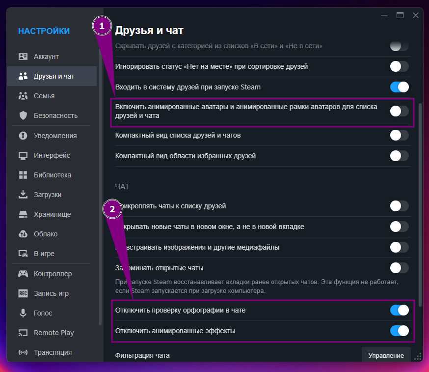
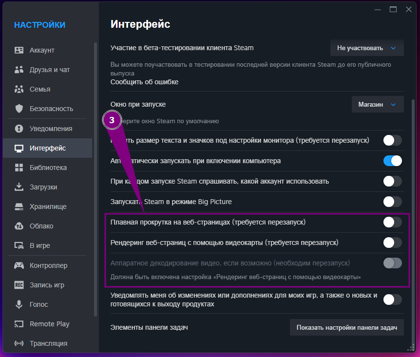
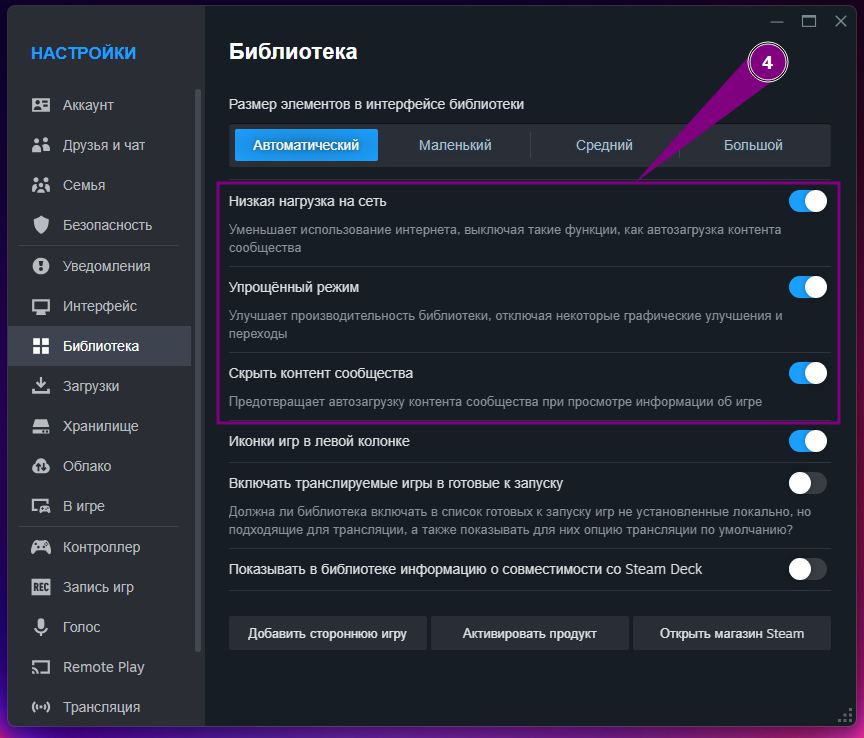
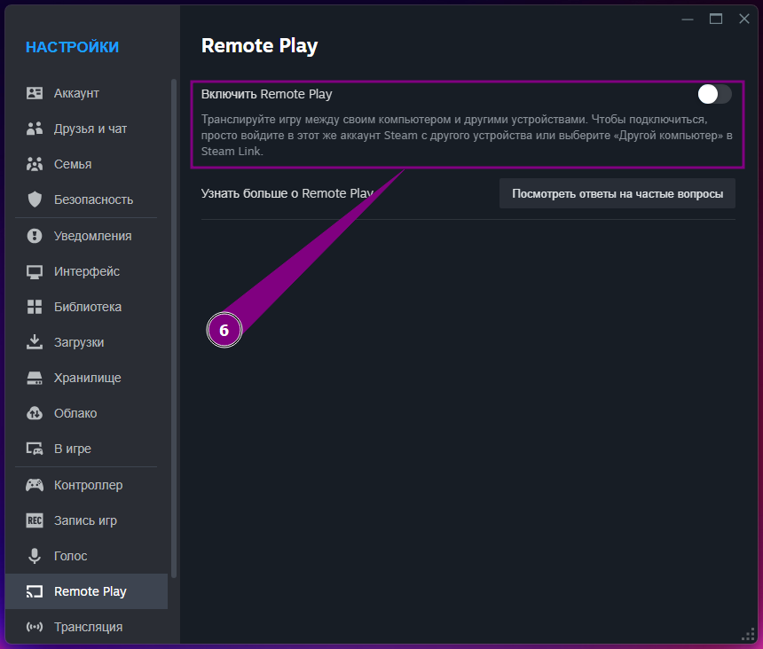
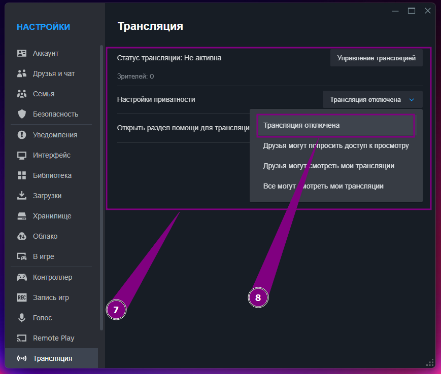
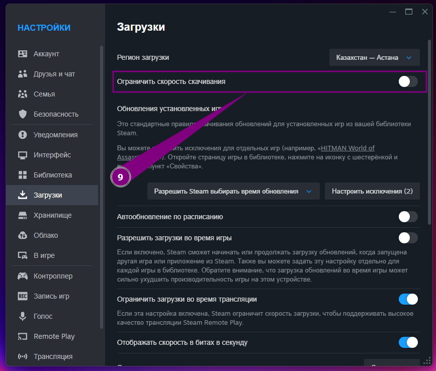
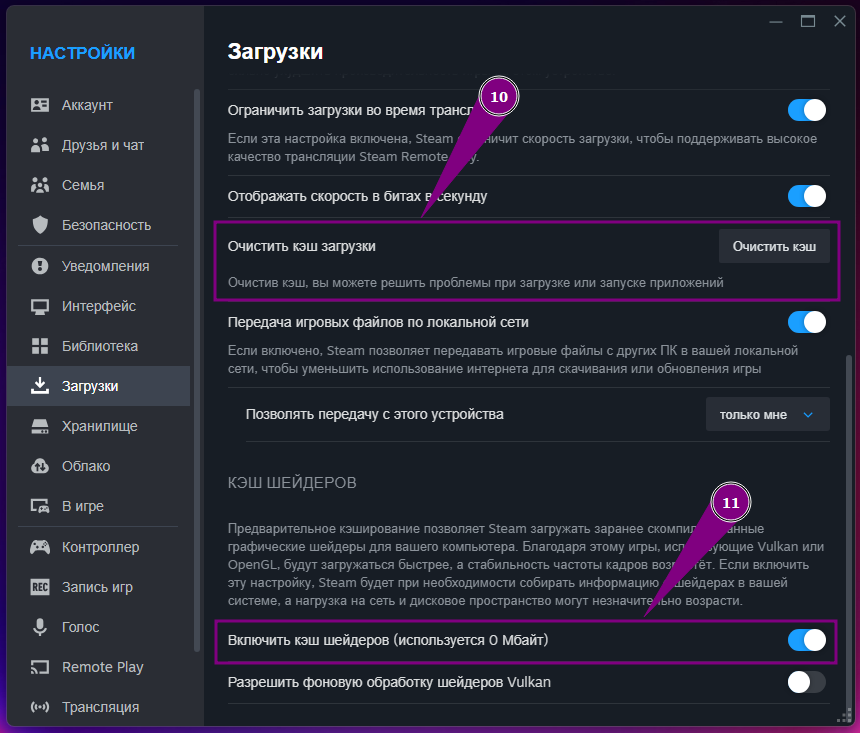

# 💻 Полная оптимизация Steam для игр

---

> **Важно:** Перед внесением изменений в настройки Steam рекомендуется создать резервную копию конфигурационных файлов или сделать снимок экрана текущих параметров. Это позволит легко вернуть прежние настройки в случае необходимости.

---

## 🎯 Основные принципы оптимизации

Оптимизация Steam для игр заключается в минимизации фоновых процессов, сокращении сетевой нагрузки и отключении ненужных визуальных эффектов внутри клиента. Каждый шаг может снизить задержки и повысить отзывчивость игрового процесса, особенно на системах со слабым интернет-соединением или ограниченными ресурсами.

---

## 🔧 Настройки Steam

### 1. Друзья и чат

- Откройте **Steam → Настройки → Друзья и чат**.
  - Отключите опцию **«Включить анимированные аватары и анимированные рамки аватаров для списка друзей и чата»**, чтобы снизить нагрузку на GPU при отображении списка друзей.
  - Включите **«Отключить анимированные эффекты»**, чтобы убрать лишние анимации в интерфейсе чата.
  - Включите **«Отключить проверку орфографии в чате»**, чтобы сократить потребление памяти и процессора при наборе сообщений.



---

### 2. Интерфейс

- Откройте **Steam → Настройки → Интерфейс**.

  - Отключите **«Плавная прокрутка на веб‑страницах (требуется перезапуск)»**, чтобы уменьшить нагрузку при прокрутке встроенных страниц.
  - Отключите **«Рендеринг веб‑страниц с помощью видеокарты (требуется перезапуск)»**, если ваша видеокарта загружена другими играми или задачами.



---

### 3. Библиотека

- Откройте **Steam → Настройки → Библиотека**.

  - Включите **«Низкая нагрузка на сеть»**, чтобы ограничить пиковое потребление пропускной способности при загрузке данных о играх и сообществе.
  - Включите **«Упрощённый режим»**, чтобы отключить анимации и дополнительные визуальные подсказки при просмотре списка игр.
  - Включите **«Скрыть контент сообщества»**, чтобы убрать вкладку с новостями и обсуждениями, снижая сетевой трафик и ускоряя загрузку библиотеки.



---

### 4. В игре

- Откройте **Steam → Настройки → В игре**.

  - При необходимости **включите «Включить оверлей Steam в игре»** только для тех игр, где вы действительно пользуетесь чатами или скриншотами через Steam.
  - Если оверлей не нужен, **отключите эту функцию**, чтобы снизить потребление ресурсов при запуске игры.


---

### 5. Remote Play

- Откройте **Steam → Настройки → Remote Play**.

  - Отключите **«Включить Remote Play»**, если вы не используете трансляцию игр на другие устройства. Это уберёт фоновые службы, связанные с распространением изображения.



---

### 6. Трансляция

- Откройте **Steam → Настройки → Трансляция**.

  - В разделе **«Настройки приватности»** установите значение **«Трансляция отключена»**, чтобы исключить автоматический запуск служб трансляции и снизить нагрузку на сеть.



---

### 7. Загрузки

- Откройте **Steam → Настройки → Загрузки**.

  - Нажмите **«Очистить кэш загрузки»**, чтобы удалить устаревшие или повреждённые файлы, которые могут замедлять процесс скачивания и устанавливать игры некорректно.
  - Отключите **«Ограничить скорость скачивания»**, если вы хотите использовать всю доступную пропускную способность для ускоренной загрузки (или, напротив, задайте конкретное ограничение, если ваш интернет нестабилен).
  - В разделе **«Кэш шейдеров»** включите **«Включить кэш шейдеров»**, чтобы сохранять скомпилированные шейдеры и ускорять последующий запуск игр на этой же системе.




---

## 🔄 Откат изменений

Если после оптимизации Steam возникли проблемы (например, некорректное отображение интерфейса или сбои при запуске игр), выполните следующие шаги:

- **Удалите файл конфигурации**
  Закройте Steam, перейдите в папку профиля пользователя:

  ```
  %path%\Steam\userdata\айди пользователя\config\
  ```

  и временно переименуйте или удалите файлы `localconfig.vdf` и `config.vdf`. После перезапуска Steam они будут воссозданы с заводскими настройками.

После возврата к исходным настройкам перезагрузите Steam и подтвердите, что проблемы устранены. Если потребуется более тонкая настройка конкретных пунктов (например, оверлея или кэша шейдеров), повторите оптимизацию, отключая или включая только необходимые опции.
