# 💻 Полная оптимизация Windows 11 для игр

---

> **Важно:** Перед внесением изменений создайте точку восстановления системы. Некоторые настройки могут повлиять на стабильность работы других программ.

---

## 🎯 Основные принципы оптимизации

Оптимизация Windows 11 24H2 для игр включает освобождение системных ресурсов, настройку приоритетов процессов, оптимизацию графических настроек и сетевого стека. Каждый шаг может улучшить производительность от 5% до 25%.

---

## 🔧 Системные оптимизации

### 1. Отключение GameBar и настройка графических параметров

- Откройте «Параметры Windows» → «Игры» → «GameBar» и отключите игровой оверлей, чтобы минимизировать фоновые процессы.

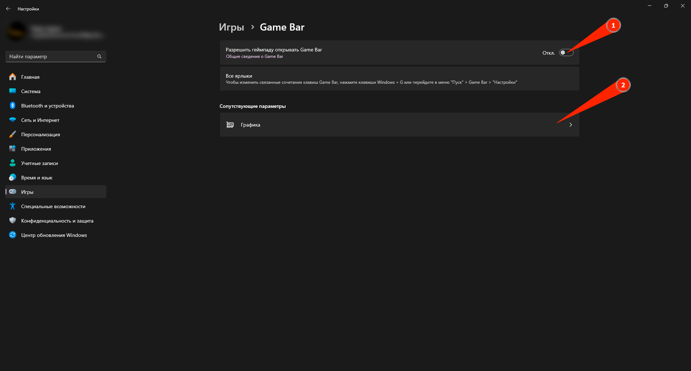

- В разделе «Параметры» → «Игры» → «Графика»:

  - Включите «Оптимизацию для игр в оконном режиме» и «Планирование графического процессора с аппаратным ускорением».

  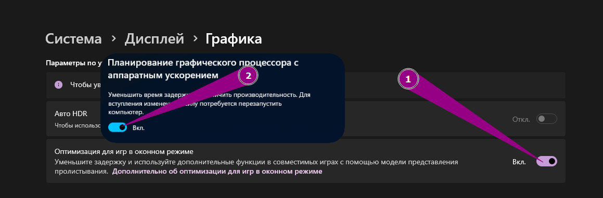

  - Для всех игровых приложений вручную выберите в списке «Высокопроизводительный графический процессор».

  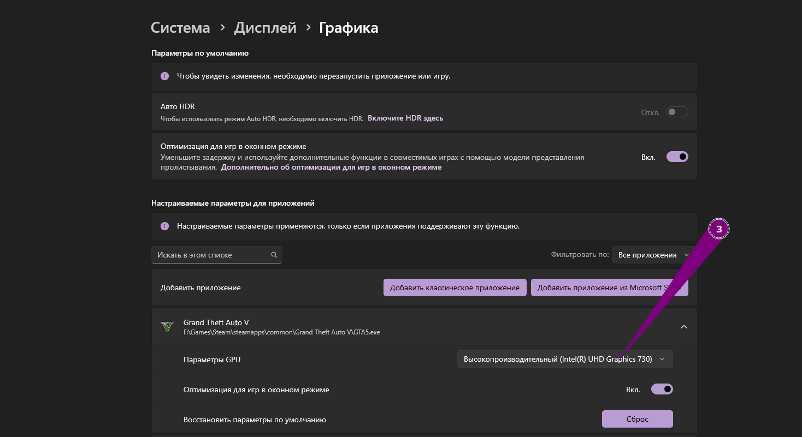

### 2. Отключение уведомлений и настройка питания

- Перейдите в «Параметры» → «Система» → «Уведомления» и полностью деактивируйте уведомления, а также включите режим «Не беспокоить», чтобы исключить всплывающие оповещения во время игры.

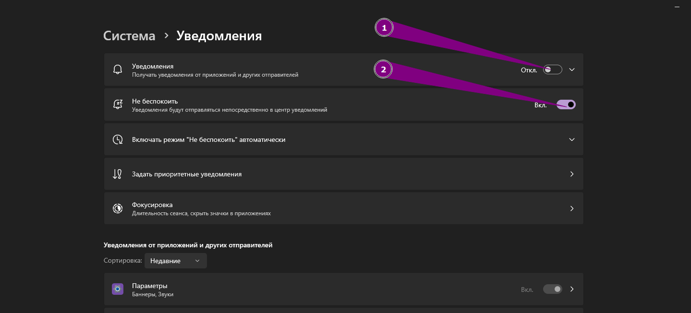

- В «Параметры» → «Система» → «Питание»:

  - Отключите «Энергосбережение».

  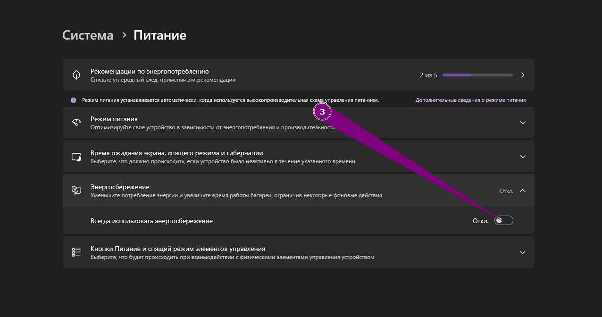

  - Затем запустите классическую «Панель управления» → «Электропитание» и выберите план «Высокая производительность».

  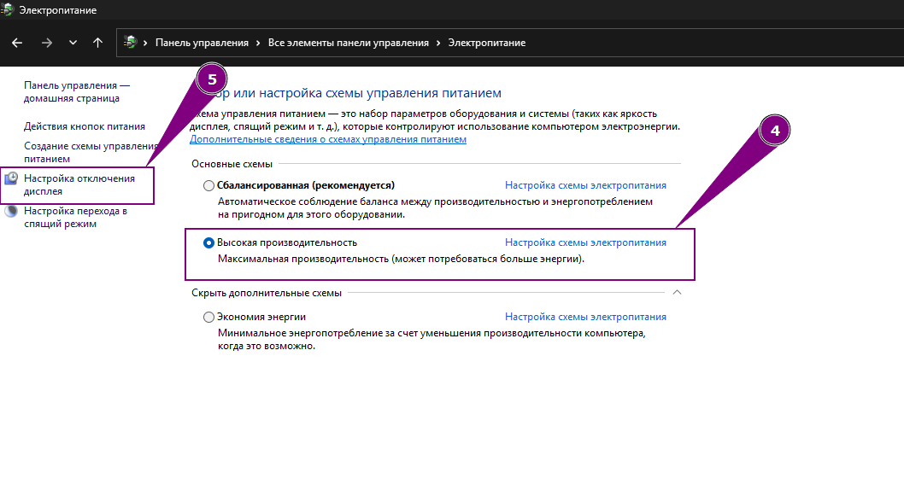

  - В «Изменить дополнительные параметры питания» найдите раздел «Параметры адаптера беспроводной сети» и выберите «Максимальная производительность».
  - Ниже в «Управление питанием процессора» установите минимальное и максимальное состояния процессора на 100%.

  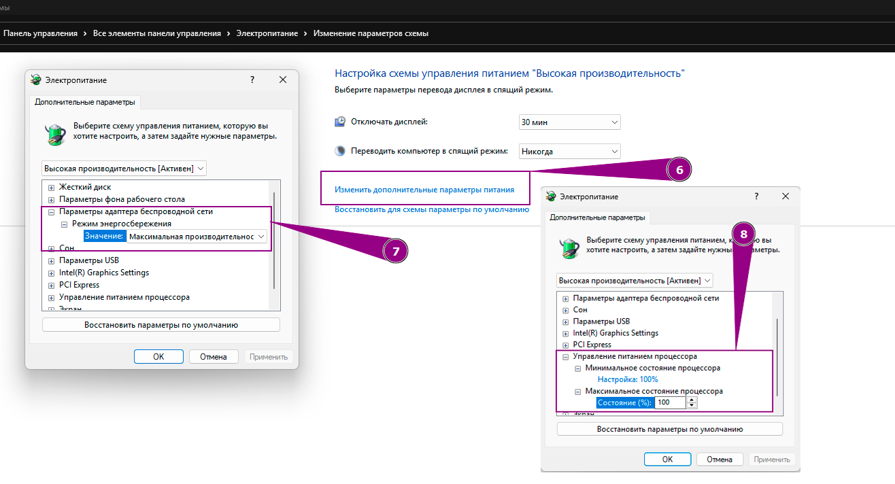

### 3. Отключение визуальных эффектов и фоновых функций

- Перейдите в «Параметры» → «Специальные возможности» → «Визуальные эффекты» и отключите «Эффекты прозрачности» и «Эффекты анимации», чтобы снизить нагрузку на GPU и CPU.

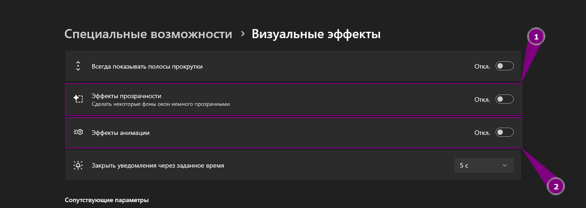

- В «Параметры» → «Конфиденциальность и защита» отключите все функции в подразделах:

  - «Общие»
  - «Голосовые функции»
  - «Персонализация рукописного ввода и ввода с клавиатуры»
  - «Диагностика и отзывы»

  Это сократит фоновые процессы и передачу данных.


### 4. Настройки обновлений Windows и автозагрузка

- Откройте «Параметры» → «Центр обновления Windows» → «Дополнительные параметры» и отключите:

  - «Получать обновления для других продуктов Microsoft»
  - «Обновлять»
  - «Скачивать обновления через лимитные подключения»
  - «Уведомлять меня о необходимости перезагрузки для завершения обновления»

  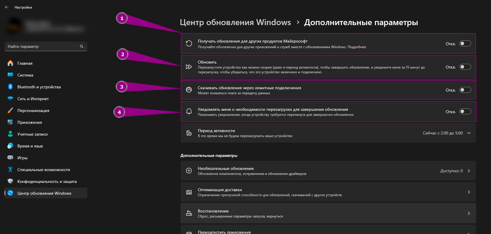

- В разделе «Оптимизация доставки» деактивируйте «Разрешить загрузки с других устройств».

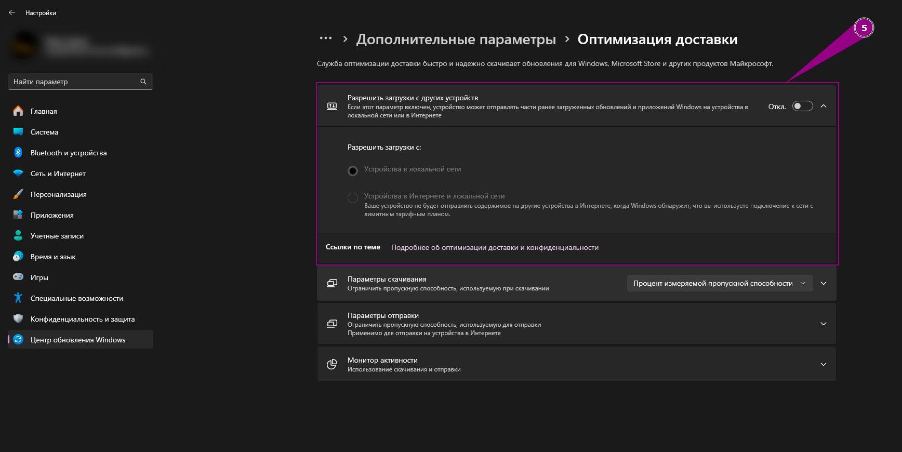

- Затем в «Параметры» → «Приложения» → «Автозагрузка» отключите все ненужные программы, чтобы они не стартовали вместе с системой.

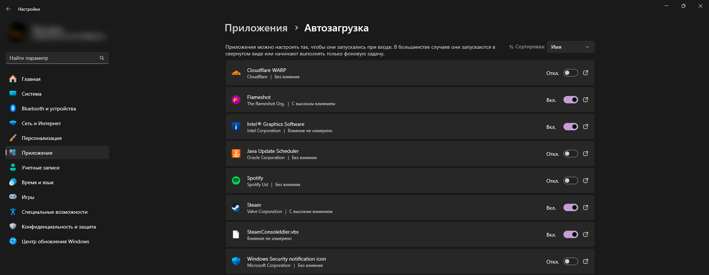

### 5. Отключение динамического освещения и настройка быстродействия

- В «Параметры» → «Персонализация» → «Динамическое освещение» отключите:
  - «Использовать динамическое освещение на моих устройствах»
  - «Совместимые приложения на переднем плане всегда управляют освещением»

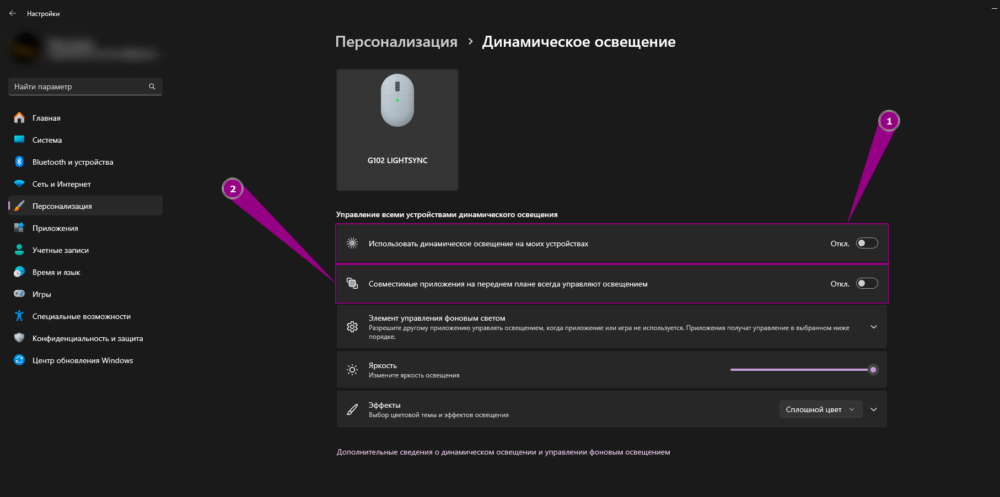

- Затем откройте «Параметры» → «Система» → «О системе» → «Дополнительные параметры системы» → «Быстродействие» → «Параметры» и выберите «Обеспечить наилучшее быстродействие». При желании оставьте только необходимые эффекты.

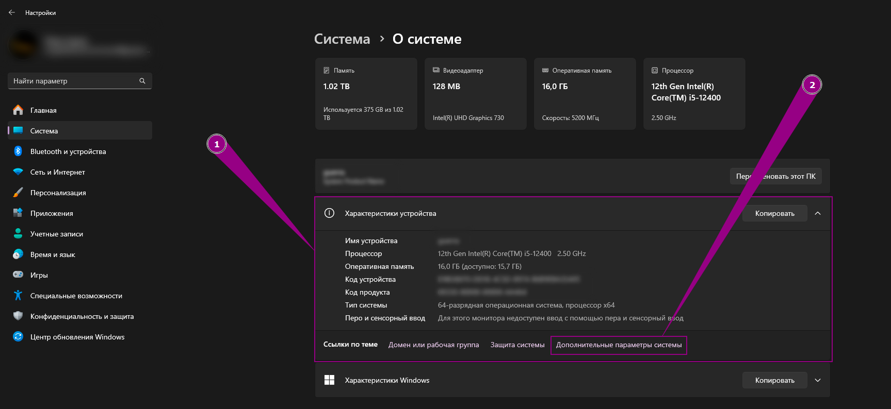


### 6. Настройки мыши и отключение изоляции ядра

- Запустите «Панель управления» → «Мышь» → «Параметры указателя» и отключите «Включить повышенную точность указателя мыши», чтобы устранить дополнительную задержку при движении курсора.

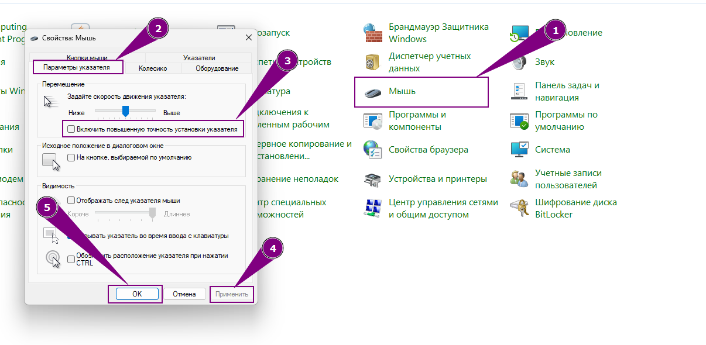

- В «Безопасность Windows» → «Безопасность устройства» отключите «Изоляцию ядра», если вы уверены, что не запускаете ненадёжные файлы.

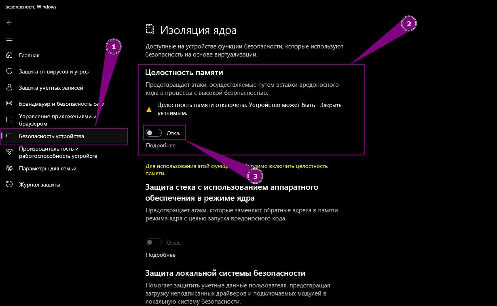

---

## 🎮 Настройки видеокарты NVIDIA

Откройте «Панель управления NVIDIA» → «Управление параметрами 3D» и в глобальных настройках (а также для конкретных игровых исполняемых файлов) убедитесь, что установлены следующие параметры:

- **Режим управления электропитанием**: Предпочтительно максимальная производительность
- **Фильтрация текстур – качество**: Высокая производительность
- **Фильтрация текстур – отрицательное отклонение уровней детализации (LOD Bias)**: Разрешить
- **Фильтрация текстур – трилинейная оптимизация**: Включено
- **Фильтрация текстур – анизотропная оптимизация выборки**: Выключено
- **Вертикальная синхронизация**: Выключено
- **Максимальное количество заранее подготовленных кадров**: 1
- **Оптимизация потоков**: Включено
- **Тройная буферизация**: Выключено
- **Сглаживание – режим**: Выключено
- **Сглаживание – прозрачность**: Выключено
- **Анизотропная фильтрация**: Выключено
- **DSR – Степень**: Выключено
- **DSR – Плавность**: Выключено
- **MFAA**: Выключено
- **Ограничение частоты кадров**: Выключено
- **Предпочтительная частота обновления**: Наивысшая доступная
- **Ускорение нескольких дисплеев/смешанных ГПУ**: Режим однодисплейной производительности
- **Шейдерный кэш**: Включено

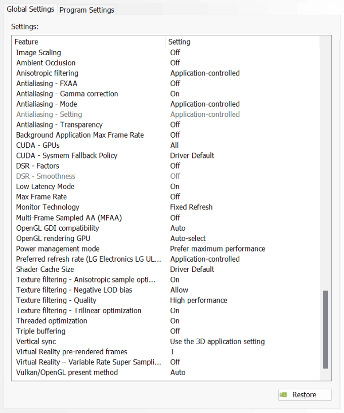

---

## 🔧 Настройки реестра

Нажмите **Win + R**, введите `regedit` и нажмите Enter. Если нужных параметров нет, создайте их вручную как _DWORD (32 бита)_. Для изменения значений, нажмите на нужный параметр → **Изменить**.

Вы также можете скачать исходный код репозитория, перейти в папку `windows-optimization/tweaks/` и запустить все готовые `.reg`-файлы для автоматического применения всех настроек реестра.

### 1. Настройки для игр

Перейдите по пути:

```
HKEY_LOCAL_MACHINE\SOFTWARE\Microsoft\Windows NT\CurrentVersion\Multimedia\SystemProfile\Tasks\Games
```

Установите или создайте следующие параметры:

- **GPU Priority**: `8`
- **Priority**: `6`
- **Scheduling Category**: _High_
- **SFIO Priority**: _High_

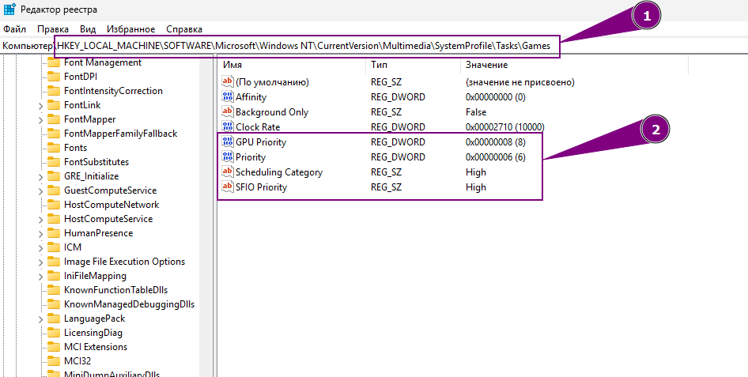

### 2. Приоритет процессов

Перейдите по пути:

```
HKEY_LOCAL_MACHINE\SYSTEM\CurrentControlSet\Control\PriorityControl
```

Установите значение **Win32PrioritySeparation** в `38`.
_При необходимости протестируйте значения `20`, `21`, `24`, `36` или `40`._

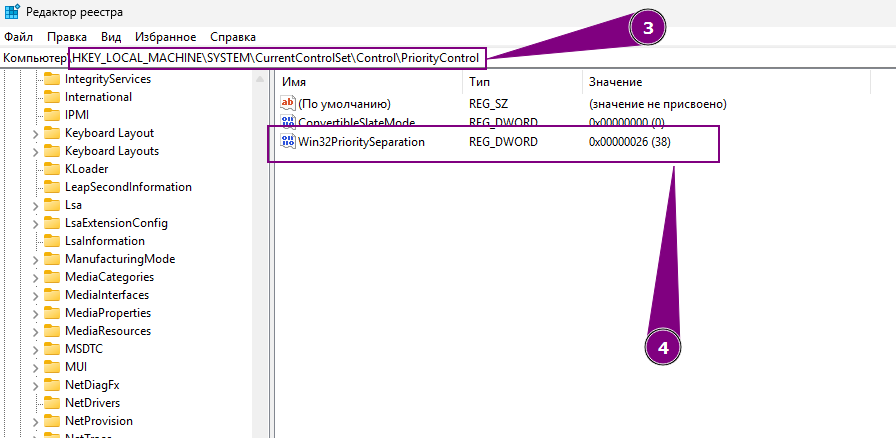

### 3. Оптимизация мультимедиа

Перейдите по пути:

```
HKEY_LOCAL_MACHINE\SOFTWARE\Microsoft\Windows NT\CurrentVersion\Multimedia\SystemProfile
```

Создайте или отредактируйте параметры:

- **NetworkThrottlingIndex**: `ffffffff` (шестнадцатеричное)
- **SystemResponsiveness**: `0`

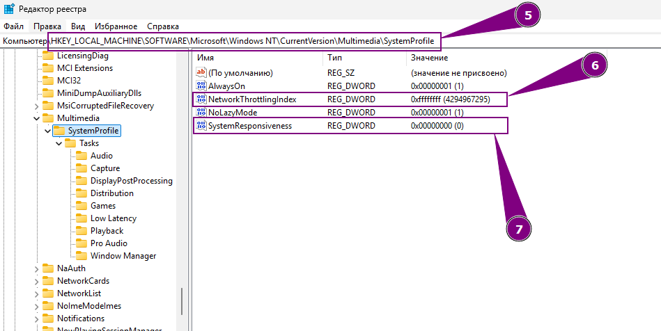

---

## 🔧 Дополнительные настройки с помощью PowerShell

> **Важно:** Для применения большинства команд PowerShell требуется запускать его **от имени администратора**.  
> Для этого нажмите **Win + X** → выберите **Windows Terminal (Администратор)** или **PowerShell (Администратор)**.

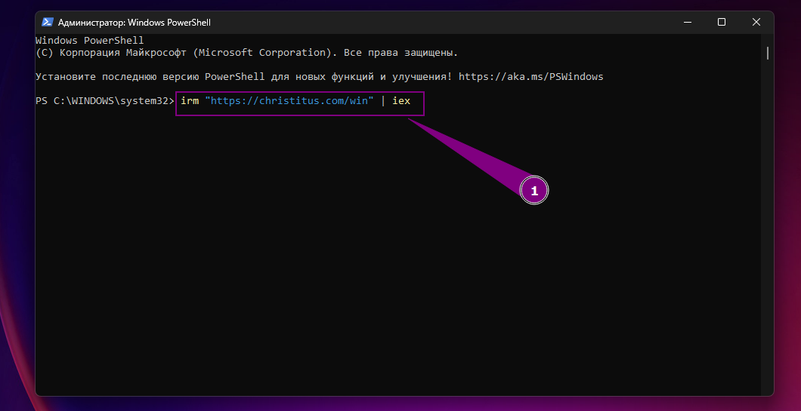

Для быстрого применения набора популярных «твиков» воспользуйтесь авторским скриптом:

```powershell
irm "https://christitus.com/win" | iex
```

После запуска утилиты перейдите в раздел **Tweaks**, выберите нужные твики (для описания нажмите на знак «?» рядом) и нажмите **Run Tweaks**. Дождитесь завершения процесса, обычно это занимает несколько минут.

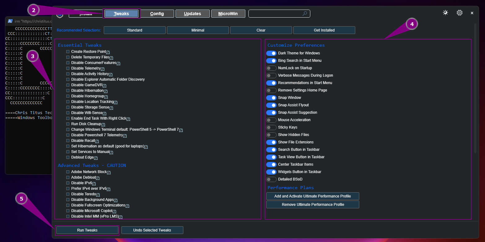

---

## 🔄 Откат изменений

Если после оптимизации возникли проблемы, выполните следующие действия:

```powershell
sfc /scannow
DISM /Online /Cleanup-Image /RestoreHealth
powercfg -restoredefaultschemes
```

Это восстановит целостность системных файлов и вернёт схемы электропитания к заводским настройкам. После завершения перезагрузите компьютер.
